# mayball.cai.cam.ac.uk

> Started in: 2023-12
>
> [View Project](https://caiusball.com)
>
> 
>
> 
> 
> 
> 
> 
> 
> 

May Ball Website is a website that I made for my college (Gonville and Caius) at the University of Cambridge to be used for the May Ball.

The May Ball is a big, fancy party at the end of the year and the website is usually used to sell tickets and show FAQs. This year the committee wanted to do something a little more advanced so they enlisted my help.

## Background

Usually every 1 or 2 years, each college at the University of Cambridge has a May Ball. This is a big, fancy party at the end of the year which takes place in May Week (which is in fact in June). This year my college wanted to have a website that was slightly more advanced than previous years' to show information, sell tickets, etc. However, the committee couldn't find anyone initially so they were considering switching to a simpler plan. While my friend, a committee-member, was telling me about this later in the term, I offered to do it and, after a quick video call, I was added to the team.

This was a great project for me (albeit quite a large one given the time constraints) since I got complete access to a high-end Linux server. I was able to practice full-stack development including system administration, database administration and back-end development along with the usual front-end development.

## Database Schema

```mermaid
erDiagram
    users {
        VARCHAR(320) email PK
        VARCHAR(150) name
    }
    
    hunt_stages {
        TINYINT(2) stage_number PK
        VARCHAR(1500) question
        VARCHAR(16) qr_code "UNIQUE"
    }
    
    hunt_answers {
        TINYINT(2) stage_number FK "PK"
        VARCHAR(100) answer "PK"
    }
    
    hunt_stages_unlocked {
        VARCHAR(320) email FK "PK"
        TINYINT(2) stage_number FK "PK"
        VARCHAR(100) last_answer "DEFAULT ''"
    }
    
    committee_members {
        VARCHAR(10) crsid PK
        VARCHAR(50) full_name
        VARCHAR(100) role
        VARCHAR(320) contact_email
        TINYINT(2) display_position "DEFAULT 99"
    }
    
    attractions {
        VARCHAR(150) name PK
        ENUM type "('Food', 'Drink', 'Stage', 'Activities')"
        VARCHAR(2000) description
        VARCHAR(50) map_id "UNIQUE DEFAULT NULL"
    }
    
    attraction_active_times {
        VARCHAR(150) attraction_name FK "PK"
        TIMESTAMP opening_time "PK"
        TIMESTAMP closing_time
    }
    
    announcements {
        VARCHAR(150) attraction_name FK "PK"
        VARCHAR(500) message "PK"
        ENUM type "('Major', 'Minor')"
        TIMESTAMP show_time "PK"
        TIMESTAMP hide_time
    }
    
    favourite_attractions {
        VARCHAR(320) email FK "PK"
        VARCHAR(150) attraction_name FK "PK"
    }
    
    queues {
        VARCHAR(150) attraction_name FK "PK"
        VARCHAR(320) administrator_email
    }
    
    queuers {
        VARCHAR(320) email FK "PK"
        VARCHAR(150) attraction_name FK "PK"
        TIMESTAMP join_time "PK"
        BOOLEAN seen "DEFAULT 0"
    }
    
    users ||--o{ hunt_stages_unlocked : " "
    users ||--o{ favourite_attractions : " "
    users ||--o{ queuers : " "
    attractions ||--|{ attraction_active_times : " "
    attractions ||--o{ announcements : " "
    attractions ||--o{ favourite_attractions : " "
    attractions ||--o{ queues : " "
    attractions ||--o{ queuers : " "
    hunt_stages ||--|{ hunt_answers : " "
    hunt_stages ||--o{ hunt_stages_unlocked : " "
```

