# mayball.cai.cam.ac.uk

> Started in: 2023-12
>
> [View Project](https://caiusball.com)
>
> 
>
> 
> 
> 
> 
> 
> 
> 
> 
> 
> 
> 
> 
> 
> 

The Gonville & Caius May Ball website is a full-stack platform I built to support one of Cambridge's largest annual events. It manages event information, live updates, ticket sales, and interactive experiences for over 1,300 guests.

The site includes features such as live countdowns to key dates, real-time announcements, scavenger hunts with QR codes, a searchable FAQ, and an interactive SVG map that updates dynamically throughout the night. It integrates with TicketTailor and Stripe for ticket sales and is fully responsive, secure, and self-hosted.

This was my first end-to-end production deployment, covering development, system administration, and live operations. The project gave me experience in real-time systems, web security, and automation under tight deadlines, and it remains one of the most ambitious technical projects I've completed to date receiving excellent feedback from both guests and the committee for an event of such scale - £250k and 1,300 attendees.

## Background

Each year, Gonville & Caius College hosts a May Ball - a large-scale formal celebration attracting over a thousand attendees. The committee needed a website capable of handling live ticket sales, publishing real-time updates, and providing an engaging user experience. Previous events had relied on static pages or third-party tools that lacked flexibility.

When the committee couldn't find a developer, I volunteered and built the entire platform in roughly four weeks during the Christmas vacation. I had full control over a dedicated Linux server (funded by the college), allowing me to manage everything from the codebase to the hosting, deployment, and security.

The site went live in early 2024 and was used successfully during the event. I am currently maintaining and enhancing it for the 2026 May Ball.

## Features

- ⌛ Live countdowns to key milestones such as ticket releases and theme reveals
- 🎫 Ticket integration via embedded TicketTailor with Stripe payment processing
- 💬 Dynamic FAQ page powered by JSON data with collapsible sections and live search
- 🧩 Interactive scavenger hunt using QR codes and riddles with progress tracking
- 🔔 Live announcements dashboard
- 📍 Interactive SVG map showing open/closed stalls with live colour and filter updates
- 🚨 Evacuation mode triggered remotely from my Apple Watch via an iOS Shortcut
- 🔒 Authentication system supporting University of Cambridge Raven login
- 🧰 Admin tools for data uploads, eligibility checks (via the University Lookup API), and automated population of databases from spreadsheets

## Database Schema

```mermaid
erDiagram
    users {
        VARCHAR(320) email PK
        VARCHAR(150) name
    }

    hunt_stages {
        TINYINT(2) stage_number PK
        VARCHAR(1500) question
        VARCHAR(16) qr_code "UNIQUE"
    }

    hunt_answers {
        TINYINT(2) stage_number FK "PK"
        VARCHAR(100) answer "PK"
    }

    hunt_stages_unlocked {
        VARCHAR(320) email FK "PK"
        TINYINT(2) stage_number FK "PK"
        VARCHAR(100) last_answer "DEFAULT ''"
    }

    committee_members {
        VARCHAR(10) crsid PK
        VARCHAR(50) full_name
        VARCHAR(100) role
        VARCHAR(320) contact_email
        TINYINT(2) display_position "DEFAULT 99"
    }

    attractions {
        VARCHAR(150) name PK
        ENUM type "('Food', 'Drink', 'Stage', 'Activities')"
        VARCHAR(2000) description
        VARCHAR(50) map_id "UNIQUE DEFAULT NULL"
    }

    attraction_active_times {
        VARCHAR(150) attraction_name FK "PK"
        TIMESTAMP opening_time "PK"
        TIMESTAMP closing_time
    }

    announcements {
        VARCHAR(150) attraction_name FK "PK"
        VARCHAR(500) message "PK"
        ENUM type "('Major', 'Minor')"
        TIMESTAMP show_time "PK"
        TIMESTAMP hide_time
    }

    favourite_attractions {
        VARCHAR(320) email FK "PK"
        VARCHAR(150) attraction_name FK "PK"
    }

    queues {
        VARCHAR(150) attraction_name FK "PK"
        VARCHAR(320) administrator_email
    }

    queuers {
        VARCHAR(320) email FK "PK"
        VARCHAR(150) attraction_name FK "PK"
        TIMESTAMP join_time "PK"
        BOOLEAN seen "DEFAULT 0"
    }

    users ||--o{ hunt_stages_unlocked : " "
    users ||--o{ favourite_attractions : " "
    users ||--o{ queuers : " "
    attractions ||--|{ attraction_active_times : " "
    attractions ||--o{ announcements : " "
    attractions ||--o{ favourite_attractions : " "
    attractions ||--o{ queues : " "
    attractions ||--o{ queuers : " "
    hunt_stages ||--|{ hunt_answers : " "
    hunt_stages ||--o{ hunt_stages_unlocked : " "
```

